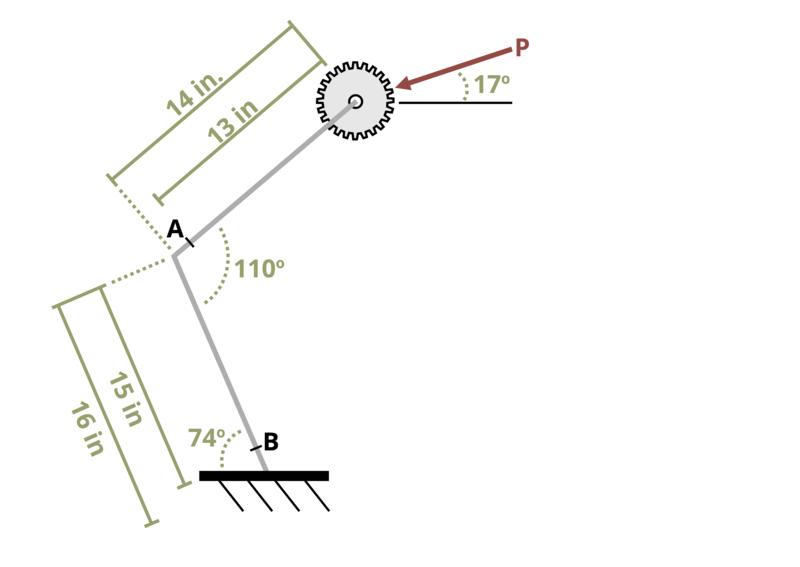

# Problem 1.6 - Internal Reactions {.unnumbered}

{fig-alt="Picture with a gear shaft being subjected to a force. The gear shaft is modeled as a ment cantilever beam with the base of the shaft being 74 degrees above the horizontal, leaning right. Between the two parts of the gear shaft, there is an angle of 110 degrees. The base of the shaft is 15 in long and then top of the shaft is 14 in long. The force, P, is applied at the top of the top of the shaft an angle of theta above the horizontal."}
\[Problem adapted from © Chris Galitz CC BY NC-SA 4.0\]
```{shinylive-python}
#| standalone: true
#| viewerHeight: 600
#| components: [viewer]

from shiny import App, render, ui, reactive
import random
import asyncio
import io
import math
import string
from datetime import datetime
from pathlib import Path

def generate_random_letters(length):
    # Generate a random string of letters of specified length
    return "".join(random.choice(string.ascii_lowercase) for _ in range(length))

problem_ID = "646"
P = reactive.Value("__")
theta = reactive.Value("__")
attempts = ["Timestamp,Attempt,Answer1,Answer2,Answer3,Feedback\n"]

app_ui = ui.page_fluid(
    ui.markdown("**Please enter your ID number from your instructor and click to generate your problem**"),
    ui.input_text("ID", "", placeholder="Enter ID Number Here"),
    ui.input_action_button("generate_problem", "Generate Problem", class_="btn-primary"),
    ui.markdown("**Problem Statement**"),
    ui.output_ui("ui_problem_statement"),
    ui.input_text("answer1", "Your Answer 1 in units of lb", placeholder="Please enter your answer 1"),
    ui.input_text("answer2", "Your Answer 2 in units of lb", placeholder="Please enter your answer 2"),
    ui.input_text("answer3", "Your Answer 3 in units of lb-in", placeholder="Please enter your answer 2"),

    ui.input_action_button("submit", "Submit Answers", class_="btn-primary"),
    ui.download_button("download", "Download File to Submit", class_="btn-success"),
)

def server(input, output, session):
    # Initialize a counter for attempts
    attempt_counter = reactive.Value(0)

    @output
    @render.ui
    def ui_problem_statement():
        return [
            ui.markdown(
                f"A gear shift, once engaged, can be modeled as the bent cantilever beam shown. If a force, P = {P()} lb at angle Θ = {theta()}, was used to engage the shifter, determine the magnitude of the internal normal force, N, shear force, V, and bending moment, M, at point B."
            )
        ]

    @reactive.Effect
    @reactive.event(input.generate_problem)
    def randomize_vars():
        random.seed(int(input.ID())+100)
        P.set(random.randrange(20,75,1))
        theta.set(random.randrange(10,25,1))

    @reactive.Effect
    @reactive.event(input.submit)
    def _():
        attempt_counter.set(
            attempt_counter() + 1
        )  # Increment the attempt counter on each submission.

        # Calculate the instructor's answer and determine if the user's answer is correct.
        instr1 = abs(P()*math.cos((70+theta())*math.pi/180))
        instr2 = abs(P()*math.sin((70+theta())*math.pi/180))
        instr3 = abs(P()*math.sin((70+theta())*math.pi/180)*(15+14*math.cos(70*math.pi/180))-P()*math.cos((70+theta())*math.pi/180)*14*math.sin(70*math.pi/180))

        correct1 = math.isclose(float(input.answer1()), instr1, rel_tol=0.01)
        correct2 = math.isclose(float(input.answer2()), instr2, rel_tol=0.01)
        correct3 = math.isclose(float(input.answer3()), instr3, rel_tol=0.01)

        if correct1 and correct2 and correct3:
            check = "All answers are correct."
        else:
            conditions = []
            for i, correct in enumerate([correct1, correct2, correct3], start=1):
                if correct:
                    conditions.append(f"correct for answer {i}")
                else:
                    conditions.append(f"incorrect for answer {i}")
            check = "; ".join(conditions) + "."
        
        correct_indicator = "JL" if correct1 and correct2 and correct3 else "JG"

        random_start = generate_random_letters(4)
        random_middle = generate_random_letters(4)
        random_end = generate_random_letters(4)
        encoded_attempt = f"{random_start}{problem_ID}-{random_middle}{attempt_counter()}{correct_indicator}-{random_end}{input.ID()}"

        session.encoded_attempt = reactive.Value(encoded_attempt)
        attempts.append(f"{datetime.now()}, {attempt_counter()}, {input.answer1()}, {input.answer2()}, {check}\n")

        feedback = ui.markdown(f"Your answers of {input.answer1()}, {input.answer2()}, and {input.answer3()} are {check}.")
        m = ui.modal(feedback, title="Feedback", easy_close=True)
        ui.modal_show(m)

    @render.download(filename=lambda: f"Problem_Log-{problem_ID}-{input.ID()}.csv")
    async def download():
        final_encoded = session.encoded_attempt() if session.encoded_attempt is not None else "No attempts"
        yield f"{final_encoded}\n\n"
        yield "Timestamp,Attempt,Answer1,Answer2,Feedback\n"
        for attempt in attempts[1:]:
            await asyncio.sleep(0.25)
            yield attempt

app = App(app_ui, server)
```
