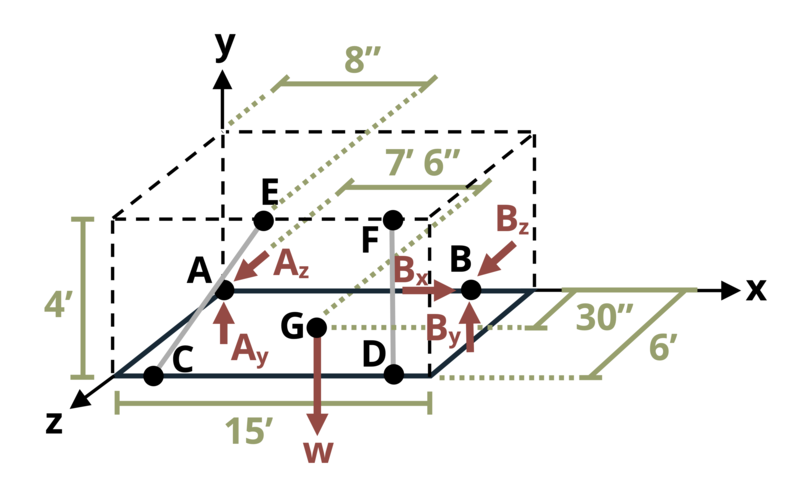

# Problem 1.8 - Equilibrium & Reactions in 3D {.unnumbered}

{fig-alt="Picture with an awning frame attached to a wall and loaded. (Picture difficult to make out)."}
\[Problem adapted from © Chris Galitz CC BY NC-SA 4.0\]
```{shinylive-python}
#| standalone: true
#| viewerHeight: 600
#| components: [viewer]

from shiny import App, render, ui, reactive
import random
import asyncio
import io
import math
import string
from datetime import datetime
from pathlib import Path

def generate_random_letters(length):
    # Generate a random string of letters of specified length
    return "".join(random.choice(string.ascii_lowercase) for _ in range(length))

problem_ID = "648"
w = reactive.Value("__")
L = reactive.Value("__")
weight = reactive.Value("__")
attempts = ["Timestamp,Attempt,Answer1,Answer2,Answer3,Answer4,Feedback\n"]

app_ui = ui.page_fluid(
    #ui.markdown("**Please enter your ID number from your instructor and click to generate your problem**"),
    #ui.input_text("ID", "", placeholder="Enter ID Number Here"),
    #ui.input_action_button("generate_problem", "Generate Problem", class_="btn-primary"),
    ui.markdown("**Problem Statement**"),
    ui.output_ui("ui_problem_statement"),
    ui.input_text("answer1", "Your Answer 1 in units of lb", placeholder="Please enter your answer 1"),
    ui.input_text("answer2", "Your Answer 2 in units of lb", placeholder="Please enter your answer 2"),
    ui.input_text("answer3", "Your Answer 3 in units of lb", placeholder="Please enter your answer 2"),
    ui.input_text("answer4", "Your Answer 4 in units of lb", placeholder="Please enter your answer 2"),

    ui.input_action_button("submit", "Submit Answers", class_="btn-primary"),
    #ui.download_button("download", "Download File to Submit", class_="btn-success"),
)

def server(input, output, session):
    # Initialize a counter for attempts
    attempt_counter = reactive.Value(0)

    @output
    @render.ui
    def ui_problem_statement():
        randomize_vars()
        return [
            ui.markdown(
                f"An awning frame of width w = {w()} ft and length L = {L()} ft is attached to a wall by two anchors and two cables as shown. The awning weighs {weight()} lb. If the cables are installed such that their tensions are all equal, determine the tension, T, and each reaction at the anchors."
            )
        ]

    #@reactive.Effect
    #@reactive.event(input.generate_problem)
    def randomize_vars():
        random.seed(101)
        w.set(random.randrange(3,10,1))
        L.set(w()*random.randrange(20,30,1)/10)
        weight.set(random.randrange(50,100,1))

    @reactive.Effect
    @reactive.event(input.submit)
    def _():
        attempt_counter.set(
            attempt_counter() + 1
        )  # Increment the attempt counter on each submission.

        # Calculate the instructor's answer and determine if the user's answer is correct.
        instr1 = 2.5*weight()/(1.106*w())
        instr2 = -0.3869*instr1
        Ay = (L()*0.552*instr1-7.5*weight())/(-L())
        instr3 = weight()-Ay-instr1*(0.552)-instr1*(0.554)
        Az = (L()*w()/7.238*instr1-0.0921*instr1*w()+w()*0.0461*instr1)/L()
        instr4 = -Az+instr1*w()/7.238+instr1*w()/7.22

        correct1 = math.isclose(float(input.answer1()), instr1, rel_tol=0.01)
        correct2 = math.isclose(float(input.answer2()), instr2, rel_tol=0.01)
        correct3 = math.isclose(float(input.answer3()), instr3, rel_tol=0.01)
        correct4 = math.isclose(float(input.answer4()), instr4, rel_tol=0.01)


        if correct1 and correct2 and correct3 and correct4:
            check = "All answers are correct."
        else:
            conditions = []
            for i, correct in enumerate([correct1, correct2, correct3, correct4], start=1):
                if correct:
                    conditions.append(f"correct for answer {i}")
                else:
                    conditions.append(f"incorrect for answer {i}")
            check = "; ".join(conditions) + "."
        
        correct_indicator = "JL" if correct1 and correct2 and correct3 and correct4 else "JG"

        random_start = generate_random_letters(4)
        random_middle = generate_random_letters(4)
        random_end = generate_random_letters(4)
        #encoded_attempt = f"{random_start}{problem_ID}-{random_middle}{attempt_counter()}{correct_indicator}-{random_end}{input.ID()}"

        #session.encoded_attempt = reactive.Value(encoded_attempt)
        attempts.append(f"{datetime.now()}, {attempt_counter()}, {input.answer1()}, {input.answer2()}, {check}\n")

        feedback = ui.markdown(f"Your answers of {input.answer1()}, {input.answer2()}, {input.answer3()}, and {input.answer4()} are {check}.")
        m = ui.modal(feedback, title="Feedback", easy_close=True)
        ui.modal_show(m)

    #@render.download(filename=lambda: f"Problem_Log-{problem_ID}-{input.ID()}.csv")
    async def download():
        final_encoded = session.encoded_attempt() if session.encoded_attempt is not None else "No attempts"
        yield f"{final_encoded}\n\n"
        yield "Timestamp,Attempt,Answer1,Answer2,Feedback\n"
        for attempt in attempts[1:]:
            await asyncio.sleep(0.25)
            yield attempt

app = App(app_ui, server)
```
