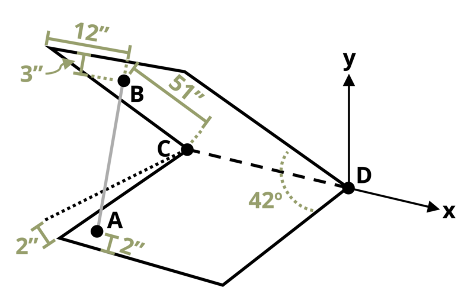

# Problem 1.9 {.unnumbered}

{fig-alt="Picture with a car hood propped open. The hood is L long an W wide. The rod to prop the hood up is sectured at point B, 3 in back from the front, 12 in. from the left side, and 51 in from the back. The bottom of the rod is located at point A which is 6 in from the left side and 2 in back. The hood is at a 42 degree angle from the horizontal."}
\[Problem adapted from © Chris Galitz CC BY NC-SA 4.0\]
```{shinylive-python}
#| standalone: true
#| viewerHeight: 600
#| components: [viewer]

from shiny import App, render, ui, reactive
import random
import asyncio
import io
import math
import string
from datetime import datetime
from pathlib import Path

def generate_random_letters(length):
    # Generate a random string of letters of specified length
    return "".join(random.choice(string.ascii_lowercase) for _ in range(length))

problem_ID = "649"
w = reactive.Value("__")
L = reactive.Value("__")
weight = reactive.Value("__")
attempts = ["Timestamp,Attempt,Answer1,Answer2,Answer3,Answer4,Answer5,Answer6,Feedback\n"]

app_ui = ui.page_fluid(
    #ui.markdown("**Please enter your ID number from your instructor and click to generate your problem**"),
    #ui.input_text("ID", "", placeholder="Enter ID Number Here"),
    #ui.input_action_button("generate_problem", "Generate Problem", class_="btn-primary"),
    ui.markdown("**Problem Statement**"),
    ui.output_ui("ui_problem_statement"),
    ui.input_text("answer1", "Your Answer 1 in units of lb", placeholder="Please enter your answer 1"),
    ui.input_text("answer2", "Your Answer 2 in units of lb", placeholder="Please enter your answer 2"),
    ui.input_text("answer3", "Your Answer 3 in units of lb", placeholder="Please enter your answer 3"),
    ui.input_text("answer4", "Your Answer 4 in units of lb", placeholder="Please enter your answer 4"),
    ui.input_text("answer5", "Your Answer 5 in units of lb", placeholder="Please enter your answer 5"),
    ui.input_text("answer6", "Your Answer 6 in units of lb", placeholder="Please enter your answer 6"),


    ui.input_action_button("submit", "Check Answers", class_="btn-primary"),
    #ui.download_button("download", "Download File to Submit", class_="btn-success"),
)

def server(input, output, session):
    # Initialize a counter for attempts
    attempt_counter = reactive.Value(0)

    @output
    @render.ui
    def ui_problem_statement():
        randomize_vars()
        return [
            ui.markdown(
                f"During engine work, a car's hood of length L = {L()} in. and width w = {w()} in., is propped up by rod AB. Hinges at C and D resist translation in the y- and z-directions but only D resists motion in the x-direction. If the hood weighs {weight()} lb, evenly distributed, determine the compressive force in rod AB and the reactions at C and D."
            )
        ]

    #@reactive.Effect
    #@reactive.event(input.generate_problem)
    def randomize_vars():
        random.seed(101)
        L.set(random.randrange(50,70,1))
        w.set(L()+random.randrange(10,20,1))
        weight.set(random.randrange(30,80,1))

    @reactive.Effect
    @reactive.event(input.submit)
    def _():
        attempt_counter.set(
            attempt_counter() + 1
        )  # Increment the attempt counter on each submission.

        # Calculate the instructor's answer and determine if the user's answer is correct.
        RDB = [-w()+12, 34.13, 37.9]
        RDA = [-w()+6, 0, L()-2]
        RDC = [-w(), 0, 0]
        RDG = [-w()/2, L()/2*0.6691, L()/2*0.7431]
        def vector_subtraction(RDB, RDA):
            return [x - y for x, y in zip(RDB, RDA)]
        RAB = vector_subtraction(RDB,RDA)
        def vector_magnitude(RAB):
            return math.sqrt(sum(x ** 2 for x in RAB))
        RABmag = vector_magnitude(RAB)
        FbarAB = [x/RABmag for x in RAB]
        comp1 = RDB[1]*FbarAB[2]-RDB[2]*FbarAB[1]
        comp2 = RDB[2]*FbarAB[0]-RDB[0]*FbarAB[2]
        comp3 = RDB[0]*FbarAB[1]-RDB[1]*FbarAB[0]
        FABCross = [comp1, comp2, comp3]
        Weightj = [0, -weight(), 0]
        comp4 = RDG[1]*Weightj[2]-RDG[2]*Weightj[1]
        comp5 = RDG[2]*Weightj[0]-RDG[0]*Weightj[2]
        comp6 = RDG[0]*Weightj[1]-RDG[1]*Weightj[0]
        RDGCross = [comp4, comp5, comp6]
        instr1 = comp4/comp1
        Cract = [0,1,1]
        comp7 = RDC[1]*Cract[2]-RDC[2]*Cract[1]
        comp8 = RDC[2]*Cract[0]-RDC[0]*Cract[2]
        comp9 = RDC[0]*Cract[1]-RDC[1]*Cract[0]
        RDCCross = [comp7, comp8, comp9]
        instr2 = comp2*instr1/comp8
        instr3 = (comp3*instr1-comp6)/comp9
        instr4 = -FbarAB[0]*instr1
        instr5 = -FbarAB[1]*instr1+weight()-instr3
        instr6 = -FbarAB[2]-instr2 
  
        correct1 = math.isclose(float(input.answer1()), instr1, rel_tol=0.01)
        correct2 = math.isclose(float(input.answer2()), instr2, rel_tol=0.01)
        correct3 = math.isclose(float(input.answer3()), instr3, rel_tol=0.01)
        correct4 = math.isclose(float(input.answer4()), instr4, rel_tol=0.01)
        correct5 = math.isclose(float(input.answer5()), instr5, rel_tol=0.01)
        correct6 = math.isclose(float(input.answer6()), instr6, rel_tol=0.01)

        if correct1 and correct2 and correct3 and correct4 and correct5 and correct6:
            check = "All answers are correct."
        else:
            conditions = []
            for i, correct in enumerate([correct1, correct2, correct3, correct4, correct5, correct6], start=1):
                if correct:
                    conditions.append(f"correct for answer {i}")
                else:
                    conditions.append(f"incorrect for answer {i}")
            check = "; ".join(conditions) + "."
        
        correct_indicator = "JL" if correct1 and correct2 and correct3 and correct4 and correct5 and correct6 else "JG"

        random_start = generate_random_letters(4)
        random_middle = generate_random_letters(4)
        random_end = generate_random_letters(4)
        #encoded_attempt = f"{random_start}{problem_ID}-{random_middle}{attempt_counter()}{correct_indicator}-{random_end}{input.ID()}"

        #session.encoded_attempt = reactive.Value(encoded_attempt)
        attempts.append(f"{datetime.now()}, {attempt_counter()}, {input.answer1()}, {input.answer2()}, {check}\n")

        feedback = ui.markdown(f"Your answers of {input.answer1()}, {input.answer2()}, {input.answer3()}, {input.answer4()}, {input.answer5()}, and {input.answer6()} are {check}.")
        m = ui.modal(feedback, title="Feedback", easy_close=True)
        ui.modal_show(m)

    #@render.download(filename=lambda: f"Problem_Log-{problem_ID}-{input.ID()}.csv")
    async def download():
        final_encoded = session.encoded_attempt() if session.encoded_attempt is not None else "No attempts"
        yield f"{final_encoded}\n\n"
        yield "Timestamp,Attempt,Answer1,Answer2,Answer3,Answer4,Answer5,Answer6,Feedback\n"
        for attempt in attempts[1:]:
            await asyncio.sleep(0.25)
            yield attempt

app = App(app_ui, server)
```
