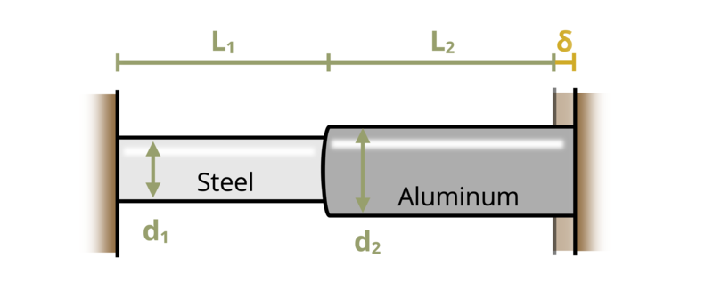

# Problem 5.43 - Statically Indeterminate Axial Loads {.unnumbered}

{fig-alt="Picture with two circular rods attached together and placed between two fixed surfaces. The left rod is made of steel and is of length L1 and radius r1. The right rod is made of aluminum and is of length L2 and radius r2."}
\[Problem adapted from © Kurt Gramoll CC BY NC-SA 4.0\]
```{shinylive-python}
#| standalone: true
#| viewerHeight: 600
#| components: [viewer]

from shiny import App, render, ui, reactive
import random
import asyncio
import io
import math
import string
from datetime import datetime
from pathlib import Path

def generate_random_letters(length):
    # Generate a random string of letters of specified length
    return ''.join(random.choice(string.ascii_lowercase) for _ in range(length))

problem_ID="261"
delta=reactive.Value("__")
L1=reactive.Value("__")
L2=reactive.Value("__")
r1=reactive.Value("__")
r2=reactive.Value("__")

attempts=["Timestamp,Attempt,Answer,Feedback\n"]

app_ui = ui.page_fluid(
    #ui.markdown("**Please enter your ID number from your instructor and click to generate your problem**"),
    #ui.input_text("ID","", placeholder="Enter ID Number Here"),
    #ui.input_action_button("generate_problem", "Generate Problem", class_="btn-primary"),
    ui.markdown("**Problem Statement**"),
    ui.output_ui("ui_problem_statement"),
    ui.input_text("answer","Your Answer in units of kip", placeholder="Please enter your answer"),
    ui.input_action_button("submit", "Submit Answer", class_="btn-primary"),
    #ui.download_button("download", "Download File to Submit", class_="btn-success"),
)

def server(input, output, session):
    # Initialize a counter for attempts
    attempt_counter = reactive.Value(0)

    @output
    @render.ui
    def ui_problem_statement():
        randomize_vars()
        return[ui.markdown(f"Two circular rods are attached together and placed between two fixed surfaces. The right surface is moved to the right by ẟ = {delta()} in., stretching the two rods. Determine the force at the right wall. Assume E<sub>steel</sub> = 29,000 ksi, E<sub>alum</sub> = 10,000 ksi, L<sub>1</sub> = {L1()} in., L<sub>2</sub> = {L2()} in., r<sub>1</sub> = {r1()} in., and r<sub>2</sub> = {r2()} in.")]
    
    #@reactive.Effect
    #@reactive.event(input.generate_problem)
    def randomize_vars():
        random.seed(101)
        delta.set(random.randrange(1,5,1)/100)
        L1.set(random.randrange(5,20,1))
        L2.set(round(L1()*1.3,1))
        r1.set(random.randrange(20,200,5)/100)
        r2.set(round(r1()*1.5,1))
    
    @reactive.Effect
    @reactive.event(input.submit)
    def _():
        attempt_counter.set(attempt_counter() + 1)  # Increment the attempt counter on each submission.
        
        instr = delta()/(L1()/(29*10**6*r1()**2*math.pi)+L2()/(10*10**6*math.pi*r2()**2))/1000
        if math.isclose(float(input.answer()), instr, rel_tol=0.01):
            check = "*Correct*"
            correct_indicator = "JL"
        else:
            check = "*Not Correct.*"
            correct_indicator = "JG"

        # Generate random parts for the encoded attempt.
        random_start = generate_random_letters(4)
        random_middle = generate_random_letters(4)
        random_end = generate_random_letters(4)
        #encoded_attempt = f"{random_start}{problem_ID}-{random_middle}{attempt_counter()}{correct_indicator}-{random_end}{input.ID()}"

        # Store the most recent encoded attempt in a reactive value so it persists across submissions
        #session.encoded_attempt = reactive.Value(encoded_attempt)

        # Append the attempt data to the attempts list without the encoded attempt
        attempts.append(f"{datetime.now()}, {attempt_counter()}, {input.answer()}, {check}\n")

        # Show feedback to the user.
        feedback = ui.markdown(f"Your answer of {input.answer()} is {check}.")
        m = ui.modal(
            feedback,
            title="Feedback",
            easy_close=True
        )
        ui.modal_show(m)

    #@render.download(filename=lambda: f"Problem_Log-{problem_ID}-{input.ID()}.csv")
    async def download():
        # Start the CSV with the encoded attempt (without label)
        final_encoded = session.encoded_attempt() if session.encoded_attempt is not None else "No attempts"
        yield f"{final_encoded}\n\n"
        
        # Write the header for the remaining CSV data once
        yield "Timestamp,Attempt,Answer,Feedback\n"
        
        # Write the attempts data, ensure that the header from the attempts list is not written again
        for attempt in attempts[1:]:  # Skip the first element which is the header
            await asyncio.sleep(0.25)  # This delay may not be necessary; adjust as needed
            yield attempt

# App installation
app = App(app_ui, server)
```
