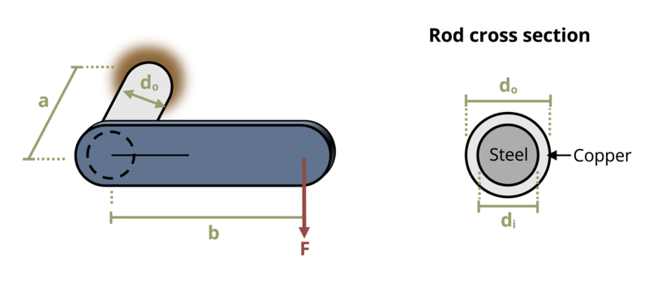

# Problem 6.32 - Statically Indeterminate Torsion {.unnumbered}

{fig-alt="Picture with a bracket firmly attached to a wall subjected to a load. The bracket has a length of b, is a distance of a from the wall, and is on a shaft of diameter do The shaft is made of copper and steel with a steel diameter of di and a copper diameter of do."}
\[Problem adapted from © Kurt Gramoll CC BY NC-SA 4.0\]
```{shinylive-python}
#| standalone: true
#| viewerHeight: 600
#| components: [viewer]

from shiny import App, render, ui, reactive
import random
import asyncio
import io
import math
import string
from datetime import datetime
from pathlib import Path

def generate_random_letters(length):
    # Generate a random string of letters of specified length
    return ''.join(random.choice(string.ascii_lowercase) for _ in range(length))  

problem_ID="294"
F=reactive.Value("__")
di=reactive.Value("__")
do=reactive.Value("__")
a=reactive.Value("__")
b=reactive.Value("__")
  
attempts=["Timestamp,Attempt,Answer,Feedback\n"]

app_ui = ui.page_fluid(
    ui.markdown("**Please enter your ID number from your instructor and click to generate your problem**"),
    ui.input_text("ID","", placeholder="Enter ID Number Here"),
    ui.input_action_button("generate_problem", "Generate Problem", class_="btn-primary"),
    ui.markdown("**Problem Statement**"),
    ui.output_ui("ui_problem_statement"),
    ui.input_text("answer","Your Answer in units of MPa", placeholder="Please enter your answer"),
    ui.input_action_button("submit", "Submit Answer", class_="btn-primary"),
    ui.download_button("download", "Download File to Submit", class_="btn-success"),
)

def server(input, output, session):
    # Initialize a counter for attempts
    attempt_counter = reactive.Value(0)

    @output
    @render.ui
    def ui_problem_statement():
        return[ui.markdown(f"A load F = {F()} kN is applied to a bracket that is firmly attached to a wall. The rod is composed of a solid steel (G = 80 GPa) inner rod of diameter d<sub>i</sub> = {di()} mm rigidly bonded to a copper (G = 48 GPa) outer casing of diameter d<sub>o</sub> = {do()} mm. Determine the maximum shear stress in either material. Assume dimensions a = {a()} mm and b = {b()} mm.")]
    
    @reactive.Effect
    @reactive.event(input.generate_problem)
    def randomize_vars():
        random.seed(input.ID()+100)
        F.set(random.randrange(10,50,1)/10)
        di.set(random.randrange(25,40,1))
        do.set(di()+random.randrange(5,15,1))
        a.set(random.randrange(100,200,1))
        b.set(a()+random.randrange(30,60,1))
        
    @reactive.Effect
    @reactive.event(input.submit)
    def _():
        attempt_counter.set(attempt_counter() + 1)  # Increment the attempt counter on each submission.
        Jc = ((do()/2000)**4-(di()/2000)**4)*math.pi/2
        Js = (di()/2000)**4*math.pi/2
        T = F()*1000*b()/1000
        Gc = 48*10**9
        Gs = 80*10**9
        TS = T/(Jc*Gc)/(1/(Js*Gs)+1/(Jc*Gc))
        TC = T-TS
        tauS = TS*b()/1000/Js
        tauC = TC*do()/2000/Jc
        instr= max(tauS,tauC)/1000000
        if math.isclose(float(input.answer()), instr, rel_tol=0.01):
            check = "*Correct*"
            correct_indicator = "JL"
        else:
            check = "*Not Correct.*"
            correct_indicator = "JG"

        # Generate random parts for the encoded attempt.
        random_start = generate_random_letters(4)
        random_middle = generate_random_letters(4)
        random_end = generate_random_letters(4)
        encoded_attempt = f"{random_start}{problem_ID}-{random_middle}{attempt_counter()}{correct_indicator}-{random_end}{input.ID()}"

        # Store the most recent encoded attempt in a reactive value so it persists across submissions
        session.encoded_attempt = reactive.Value(encoded_attempt)

        # Append the attempt data to the attempts list without the encoded attempt
        attempts.append(f"{datetime.now()}, {attempt_counter()}, {input.answer()}, {check}\n")

        # Show feedback to the user.
        feedback = ui.markdown(f"Your answer of {input.answer()} is {check}.")
        m = ui.modal(
            feedback,
            title="Feedback",
            easy_close=True
        )
        ui.modal_show(m)

    @session.download(filename=lambda: f"Problem_Log-{problem_ID}-{input.ID()}.csv")
    async def download():
        # Start the CSV with the encoded attempt (without label)
        final_encoded = session.encoded_attempt() if session.encoded_attempt is not None else "No attempts"
        yield f"{final_encoded}\n\n"
        
        # Write the header for the remaining CSV data once
        yield "Timestamp,Attempt,Answer,Feedback\n"
        
        # Write the attempts data, ensure that the header from the attempts list is not written again
        for attempt in attempts[1:]:  # Skip the first element which is the header
            await asyncio.sleep(0.25)  # This delay may not be necessary; adjust as needed
            yield attempt
            
# App installation
app = App(app_ui, server)
```
