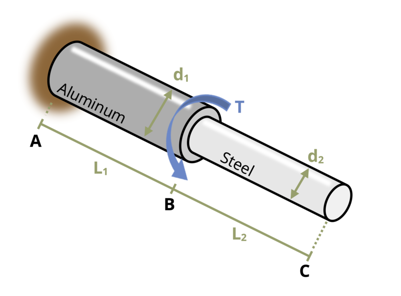

# Problem 6.34 - Statically Indeterminate Torsion {.unnumbered}

{fig-alt="Picture with a steel rod and an aluminum rod attached firmly between two walls. The aluminum rod has a length of L1 and a diameter of d1. The steel rod has a length of L2 and a diameter of d2."}
\[Problem adapted from © Kurt Gramoll CC BY NC-SA 4.0\]
```{shinylive-python}
#| standalone: true
#| viewerHeight: 600
#| components: [viewer]

from shiny import App, render, ui, reactive
import random
import asyncio
import io
import math
import string
from datetime import datetime
from pathlib import Path

def generate_random_letters(length):
    # Generate a random string of letters of specified length
    return ''.join(random.choice(string.ascii_lowercase) for _ in range(length))  

problem_ID="301"
L1=reactive.Value("__")
L2=reactive.Value("__")
d2=reactive.Value("__")
d1=reactive.Value("__")
angle=reactive.Value("__")
  
attempts=["Timestamp,Attempt,Answer,Feedback\n"]

app_ui = ui.page_fluid(
    #ui.markdown("**Please enter your ID number from your instructor and click to generate your problem**"),
    #ui.input_text("ID","", placeholder="Enter ID Number Here"),
    #ui.input_action_button("generate_problem", "Generate Problem", class_="btn-primary"),
    ui.markdown("**Problem Statement**"),
    ui.output_ui("ui_problem_statement"),
    ui.input_text("answer","Your Answer in units of lb-in", placeholder="Please enter your answer"),
    ui.input_action_button("submit", "Submit Answer", class_="btn-primary"),
    #ui.download_button("download", "Download File to Submit", class_="btn-success"),
)

def server(input, output, session):
    # Initialize a counter for attempts
    attempt_counter = reactive.Value(0)

    @output
    @render.ui
    def ui_problem_statement():
        randomize_vars()
        return[ui.markdown(f"A steel (G = 12,700 ksi) rod and an aluminum (G = 4,300 ksi) rod are attached firmly between two walls as shown. The lengths are L<sub>1</sub> = {L1()} in. and L<sub>2</sub> = {L2()} in., while the diameters are d<sub>1</sub> = {d1()} in. and d<sub>2</sub> = {d2()} in. A torque T is applied at the joint between ther rods and it is measureed that the joint rotates {angle()}°. Determine the magnitude of torque T.")]
    
    #@reactive.Effect
    #@reactive.event(input.generate_problem)
    def randomize_vars():
        random.seed(101)
        L1.set(random.randrange(5,25,1))
        L2.set(L1()+random.randrange(2,5,1))
        d2.set(random.randrange(50,300,5)/100)
        d1.set(d2()+random.randrange(25,100,5)/100)
        angle.set(random.randrange(10,50,1)/10)
        
    @reactive.Effect
    @reactive.event(input.submit)
    def _():
        attempt_counter.set(attempt_counter() + 1)  # Increment the attempt counter on each submission.
        Js = math.pi*(d2()/2)**4/2
        Jal = math.pi*(d1()/2)**4/2
        Ts = angle()*math.pi/180*Js*12700000/L2()
        Tal = angle()*math.pi/180*Jal*4300000/L1()
        instr= Ts+Tal
        if math.isclose(float(input.answer()), instr, rel_tol=0.01):
            check = "*Correct*"
            correct_indicator = "JL"
        else:
            check = "*Not Correct.*"
            correct_indicator = "JG"

        # Generate random parts for the encoded attempt.
        random_start = generate_random_letters(4)
        random_middle = generate_random_letters(4)
        random_end = generate_random_letters(4)
        #encoded_attempt = f"{random_start}{problem_ID}-{random_middle}{attempt_counter()}{correct_indicator}-{random_end}{input.ID()}"

        # Store the most recent encoded attempt in a reactive value so it persists across submissions
        #session.encoded_attempt = reactive.Value(encoded_attempt)

        # Append the attempt data to the attempts list without the encoded attempt
        attempts.append(f"{datetime.now()}, {attempt_counter()}, {input.answer()}, {check}\n")

        # Show feedback to the user.
        feedback = ui.markdown(f"Your answer of {input.answer()} is {check}.")
        m = ui.modal(
            feedback,
            title="Feedback",
            easy_close=True
        )
        ui.modal_show(m)

    #@render.download(filename=lambda: f"Problem_Log-{problem_ID}-{input.ID()}.csv")
    async def download():
        # Start the CSV with the encoded attempt (without label)
        final_encoded = session.encoded_attempt() if session.encoded_attempt is not None else "No attempts"
        yield f"{final_encoded}\n\n"
        
        # Write the header for the remaining CSV data once
        yield "Timestamp,Attempt,Answer,Feedback\n"
        
        # Write the attempts data, ensure that the header from the attempts list is not written again
        for attempt in attempts[1:]:  # Skip the first element which is the header
            await asyncio.sleep(0.25)  # This delay may not be necessary; adjust as needed
            yield attempt
            
# App installation
app = App(app_ui, server)
```
