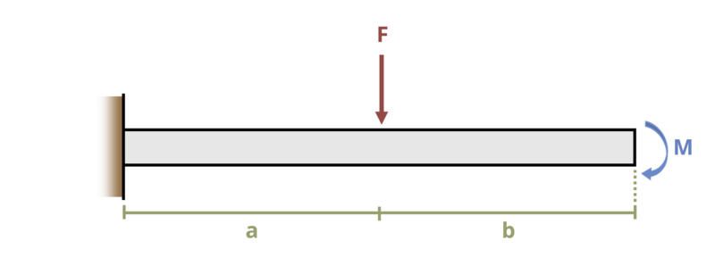

# Problem 7.21 - Shear Force & Bending Moment Equations {.unnumbered}

{fig-alt="A cantilever beam is subjected to a moment and a force. The beam is of length a+b. The moment is applied clockwise at the right end of the beam and force F is applied a distance of a from the left wall."}
\[Problem adapted from © Kurt Gramoll CC BY NC-SA 4.0\]
```{shinylive-python}
#| standalone: true
#| viewerHeight: 600
#| components: [viewer]

from shiny import App, render, ui, reactive
import random
import asyncio
import io
import math
import string
from datetime import datetime
from pathlib import Path

def generate_random_letters(length):
    # Generate a random string of letters of specified length
    return "".join(random.choice(string.ascii_lowercase) for _ in range(length))

problem_ID = "329"
F = reactive.Value("__")
M = reactive.Value("__")
b = reactive.Value("__")
a = reactive.Value("__")
attempts = ["Timestamp,Attempt,Answer1,Answer2,Feedback\n"]

app_ui = ui.page_fluid(
    ui.markdown("**Please enter your ID number from your instructor and click to generate your problem**"),
    ui.input_text("ID", "", placeholder="Enter ID Number Here"),
    ui.input_action_button("generate_problem", "Generate Problem", class_="btn-primary"),
    ui.markdown("**Problem Statement**"),
    ui.output_ui("ui_problem_statement"),
    ui.input_text("answer1", "Your Answer 1 in units of lb", placeholder="Please enter your answer 1"),
    ui.input_text("answer2", "Your Answer 2 in units of lb-ft", placeholder="Please enter your answer 2"),
    ui.input_action_button("submit", "Submit Answers", class_="btn-primary"),
    ui.download_button("download", "Download File to Submit", class_="btn-success"),
)

def server(input, output, session):
    # Initialize a counter for attempts
    attempt_counter = reactive.Value(0)

    @output
    @render.ui
    def ui_problem_statement():
        return [
            ui.markdown(
                f"Plot the shear force and bending moment diagrams for the loading shown. Assume loads F = {F()} lb and M = {M()} lb-ft, and lengths a = {a()} ft and b = {b()} ft. What is the maximum absolute shear force and maximum absolute bending moment?."
            )
        ]

    @reactive.Effect
    @reactive.event(input.generate_problem)
    def randomize_vars():
        random.seed(input.ID()+100)
        F.set(random.randrange(50,200,5))
        M.set(random.randrange(250,500,10))
        b.set(random.randrange(50,100,1)/10)
        a.set(b()+round(random.randrange(10,20,1)/10))
        
    @reactive.Effect
    @reactive.event(input.submit)
    def _():
        attempt_counter.set(
            attempt_counter() + 1
        )  # Increment the attempt counter on each submission.

        # Calculate the instructor's answer and determine if the user's answer is correct.
        instr1 = F()
        instr2 = F()*a()+M()

        correct1 = math.isclose(float(input.answer1()), instr1, rel_tol=0.01)
        correct2 = math.isclose(float(input.answer2()), instr2, rel_tol=0.01)
        
        if correct1 and correct2:
            check = f"{'both correct.'}"
        elif correct1:
            check = f" {'correct for answer 1 and incorrect for answer 2.'}"
        elif correct2:
            check = f"{'incorrect for answer 1 and correct for answer 2.'}"
        else:
            check = f"{'both incorrect.'}"
        
        correct_indicator = "JL" if correct1 and correct2 else "JG"

        random_start = generate_random_letters(4)
        random_middle = generate_random_letters(4)
        random_end = generate_random_letters(4)
        encoded_attempt = f"{random_start}{problem_ID}-{random_middle}{attempt_counter()}{correct_indicator}-{random_end}{input.ID()}"

        session.encoded_attempt = reactive.Value(encoded_attempt)
        attempts.append(f"{datetime.now()}, {attempt_counter()}, {input.answer1()}, {input.answer2()}, {check}\n")

        feedback = ui.markdown(f"Your answers of {input.answer1()} and {input.answer2()} are {check}.")
        m = ui.modal(feedback, title="Feedback", easy_close=True)
        ui.modal_show(m)

    @session.download(filename=lambda: f"Problem_Log-{problem_ID}-{input.ID()}.csv")
    async def download():
        final_encoded = session.encoded_attempt() if session.encoded_attempt is not None else "No attempts"
        yield f"{final_encoded}\n\n"
        yield "Timestamp,Attempt,Answer1,Answer2,Feedback\n"
        for attempt in attempts[1:]:
            await asyncio.sleep(0.25)
            yield attempt

app = App(app_ui, server)
```
