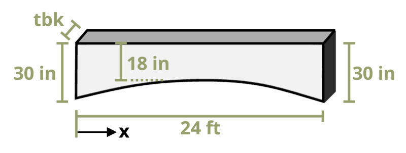

# Problem 7.23 - Determining Equations by Integration {.unnumbered}

{fig-alt="Picture with a parabolic arch that is simply supported. The block containing the arch has a height of 30 in, a length of 24 ft, and a thickness of t. The arch has a gap between its peak and the top of the block of 18 inches."}
\[Problem adapted from © Chris Galitz CC BY NC-SA 4.0\]
```{shinylive-python}
#| standalone: true
#| viewerHeight: 600
#| components: [viewer]

from shiny import App, render, ui, reactive
import random
import asyncio
import io
import math
import string
from datetime import datetime
from pathlib import Path

def generate_random_letters(length):
    # Generate a random string of letters of specified length
    return "".join(random.choice(string.ascii_lowercase) for _ in range(length))

problem_ID = "673"
t = reactive.Value("__")
w = reactive.Value("__")
attempts = ["Timestamp,Attempt,Answer1,Answer2,Feedback\n"]

app_ui = ui.page_fluid(
    #ui.markdown("**Please enter your ID number from your instructor and click to generate your problem**"),
    #ui.input_text("ID", "", placeholder="Enter ID Number Here"),
    #ui.input_action_button("generate_problem", "Generate Problem", class_="btn-primary"),
    ui.markdown("**Problem Statement**"),
    ui.output_ui("ui_problem_statement"),
    ui.input_text("answer1", "Your Answer 1 in units of lb", placeholder="Please enter your answer 1"),
    ui.input_text("answer2", "Your Answer 2 in units of lb-ft", placeholder="Please enter your answer 2"),
    ui.input_action_button("submit", "Submit Answers", class_="btn-primary"),
    #ui.download_button("download", "Download File to Submit", class_="btn-success"),
)

def server(input, output, session):
    # Initialize a counter for attempts
    attempt_counter = reactive.Value(0)

    @output
    @render.ui
    def ui_problem_statement():
        randomize_vars()
        return [
            ui.markdown(
                f"A parabolic arch is formed by the simply-supported precast concrete piece shown. Assuming the concrete has a thickness t = {t()} inches and a unit weight w = {w()} lb per cubic foot, derive the equations for beam shear, V(x) and bending moment, M(x), in the concrete. Determine the maximum magnitude for each. The height of the arch, in feet, is given by the equation h(x) = 1/144*x<sup>2</sup> - 1/6*x + 2.5."
            )
        ]

    #@reactive.Effect
    #@reactive.event(input.generate_problem)
    def randomize_vars():
        random.seed(101)
        t.set(random.randrange(6,18,1))
        w.set(random.randrange(125,175,1))
        
    @reactive.Effect
    @reactive.event(input.submit)
    def _():
        attempt_counter.set(
            attempt_counter() + 1
        )  # Increment the attempt counter on each submission.

        # Calculate the instructor's answer and determine if the user's answer is correct.
        L=24
        wxa=-1/144*t()*w()
        wxb=1/6*t()*w()
        wxc=-2.5*t()*w()
        x=L/2
        instr1=1/L*(-wxa/12*L**4-wxb/6*L**3-wxc/2*L**2)
        instr2=wxa/12*x**4+wxb/6*x**3+wxc/2*x**2+instr1*x

        correct1 = math.isclose(float(input.answer1()), instr1, rel_tol=0.01)
        correct2 = math.isclose(float(input.answer2()), instr2, rel_tol=0.01)
        
        if correct1 and correct2:
            check = f"{'both correct.'}"
        elif correct1:
            check = f" {'correct for answer 1 and incorrect for answer 2.'}"
        elif correct2:
            check = f"{'incorrect for answer 1 and correct for answer 2.'}"
        else:
            check = f"{'both incorrect.'}"
        
        correct_indicator = "JL" if correct1 and correct2 else "JG"

        random_start = generate_random_letters(4)
        random_middle = generate_random_letters(4)
        random_end = generate_random_letters(4)
        #encoded_attempt = f"{random_start}{problem_ID}-{random_middle}{attempt_counter()}{correct_indicator}-{random_end}{input.ID()}"

        #session.encoded_attempt = reactive.Value(encoded_attempt)
        attempts.append(f"{datetime.now()}, {attempt_counter()}, {input.answer1()}, {input.answer2()}, {check}\n")

        feedback = ui.markdown(f"Your answers of {input.answer1()} and {input.answer2()} are {check}")
        m = ui.modal(feedback, title="Feedback", easy_close=True)
        ui.modal_show(m)

    #@render.download(filename=lambda: f"Problem_Log-{problem_ID}-{input.ID()}.csv")
    async def download():
        final_encoded = session.encoded_attempt() if session.encoded_attempt is not None else "No attempts"
        yield f"{final_encoded}\n\n"
        yield "Timestamp,Attempt,Answer1,Answer2,Feedback\n"
        for attempt in attempts[1:]:
            await asyncio.sleep(0.25)
            yield attempt

app = App(app_ui, server)
```
