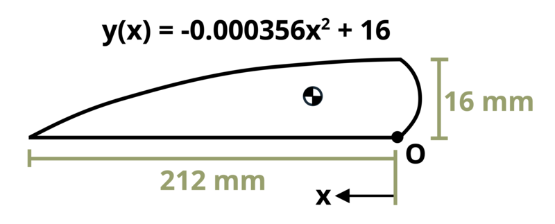

# Problem 8.3 - Centroid {.unnumbered}

{fig-alt="Picture with an experimental model aircraft wing. The wing has a length of a and a height of b. It is defined by y(x) = -0.000356*x^2+b."}
\[Problem adapted from © Chris Galitz CC BY NC-SA 4.0\]
```{shinylive-python}
#| standalone: true
#| viewerHeight: 600
#| components: [viewer]

from shiny import App, render, ui, reactive
import random
import asyncio
import io
import math
import string
from datetime import datetime
from pathlib import Path

def generate_random_letters(length):
    # Generate a random string of letters of specified length
    return "".join(random.choice(string.ascii_lowercase) for _ in range(length))

problem_ID = "677"
a = reactive.Value("__")
b = reactive.Value("__")
attempts = ["Timestamp,Attempt,Answer1,Answer2,Feedback\n"]

app_ui = ui.page_fluid(
    #ui.markdown("**Please enter your ID number from your instructor and click to generate your problem**"),
    #ui.input_text("ID", "", placeholder="Enter ID Number Here"),
    #ui.input_action_button("generate_problem", "Generate Problem", class_="btn-primary"),
    ui.markdown("**Problem Statement**"),
    ui.output_ui("ui_problem_statement"),
    ui.input_text("answer1", "Your Answer 1 in units of mm", placeholder="Please enter your answer 1"),
    ui.input_text("answer2", "Your Answer 2 in units of mm", placeholder="Please enter your answer 2"),
    ui.input_action_button("submit", "Submit Answers", class_="btn-primary"),
    #ui.download_button("download", "Download File to Submit", class_="btn-success"),
)

def server(input, output, session):
    # Initialize a counter for attempts
    attempt_counter = reactive.Value(0)

    @output
    @render.ui
    def ui_problem_statement():
        randomize_vars()
        return [
            ui.markdown(
                f"An experimental model aircraft wing incorporates a half-circular leading edge and a parabolic top surface. Determine the x- and y-coordinates of the centroid of the cross-section. Assume dimensions a = {a()} mm and b = {b()} mm."
            )
        ]

    #@reactive.Effect
    #@reactive.event(input.generate_problem)
    def randomize_vars():
        random.seed(101)
        a.set(random.randrange(150,300,5))
        b.set(random.randrange(10,30,1))
        
    @reactive.Effect
    @reactive.event(input.submit)
    def _():
        attempt_counter.set(
            attempt_counter() + 1
        )  # Increment the attempt counter on each submission.

        # Calculate the instructor's answer and determine if the user's answer is correct.
        xbar=-0.000089*a()**4+b()/2*a()**2/(-0.0001187*a()**3+b()*a())
        ybar=2.535*10**-8*a()**5-0.000356*b()*2/3*a()**3+b()**2*a()/(-0.0001187*a()**3+b()*a())
        A1=-0.0001187*a()**3+b()*a()
        A2=math.pi*b()**2/4
        x2=-4*b()/2/(3*math.pi)
        x1A1=xbar*A1
        x2A2=x2*A2
        instr1=(x1A1+x2A2)/(A1+A2)
        y2=b()/2
        y1A1=ybar*A1
        y2A2=y2*A2
        instr2=(y1A1+y2A2)/(A1+A2)

        correct1 = math.isclose(float(input.answer1()), instr1, rel_tol=0.01)
        correct2 = math.isclose(float(input.answer2()), instr2, rel_tol=0.01)
        
        if correct1 and correct2:
            check = f"{'both correct.'}"
        elif correct1:
            check = f" {'correct for answer 1 and incorrect for answer 2.'}"
        elif correct2:
            check = f"{'incorrect for answer 1 and correct for answer 2.'}"
        else:
            check = f"{'both incorrect.'}"
        
        correct_indicator = "JL" if correct1 and correct2 else "JG"

        random_start = generate_random_letters(4)
        random_middle = generate_random_letters(4)
        random_end = generate_random_letters(4)
        #encoded_attempt = f"{random_start}{problem_ID}-{random_middle}{attempt_counter()}{correct_indicator}-{random_end}{input.ID()}"

        #session.encoded_attempt = reactive.Value(encoded_attempt)
        attempts.append(f"{datetime.now()}, {attempt_counter()}, {input.answer1()}, {input.answer2()}, {check}\n")

        feedback = ui.markdown(f"Your answers of {input.answer1()} and {input.answer2()} are {check}")
        m = ui.modal(feedback, title="Feedback", easy_close=True)
        ui.modal_show(m)

    #@render.download(filename=lambda: f"Problem_Log-{problem_ID}-{input.ID()}.csv")
    async def download():
        final_encoded = session.encoded_attempt() if session.encoded_attempt is not None else "No attempts"
        yield f"{final_encoded}\n\n"
        yield "Timestamp,Attempt,Answer1,Answer2,Feedback\n"
        for attempt in attempts[1:]:
            await asyncio.sleep(0.25)
            yield attempt

app = App(app_ui, server)
```
