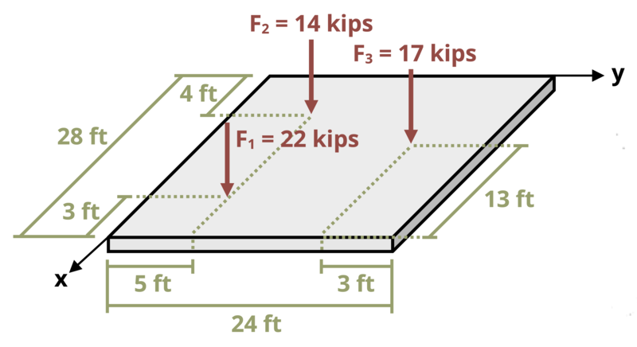

# Problem 8.4 - Centroid {.unnumbered}

{fig-alt="Picture of a parking garage slab subjected to an area load and point loads. The slab has a depth of 28 ft and a width of 24 ft. Relative to the bottom left corner, force F1 is applied 3 ft back and 5 ft right, force F2 is applied 24 ft back and 5 ft right, and force F3 is applied 13 ft back and 21 ft right."}
\[Problem adapted from © Chris Galitz CC BY NC-SA 4.0\]
```{shinylive-python}
#| standalone: true
#| viewerHeight: 600
#| components: [viewer]

from shiny import App, render, ui, reactive
import random
import asyncio
import io
import math
import string
from datetime import datetime
from pathlib import Path

def generate_random_letters(length):
    # Generate a random string of letters of specified length
    return "".join(random.choice(string.ascii_lowercase) for _ in range(length))

problem_ID = "678"
w = reactive.Value("__")
F1 = reactive.Value("__")
F2 = reactive.Value("__")
F3 = reactive.Value("__")
attempts = ["Timestamp,Attempt,Answer1,Answer2,Feedback\n"]

app_ui = ui.page_fluid(
    ui.markdown("**Please enter your ID number from your instructor and click to generate your problem**"),
    ui.input_text("ID", "", placeholder="Enter ID Number Here"),
    ui.input_action_button("generate_problem", "Generate Problem", class_="btn-primary"),
    ui.markdown("**Problem Statement**"),
    ui.output_ui("ui_problem_statement"),
    ui.input_text("answer1", "Your Answer 1 in units of ft", placeholder="Please enter your answer 1"),
    ui.input_text("answer2", "Your Answer 2 in units of ft", placeholder="Please enter your answer 2"),
    ui.input_action_button("submit", "Submit Answers", class_="btn-primary"),
    ui.download_button("download", "Download File to Submit", class_="btn-success"),
)

def server(input, output, session):
    # Initialize a counter for attempts
    attempt_counter = reactive.Value(0)

    @output
    @render.ui
    def ui_problem_statement():
        return [
            ui.markdown(
                f"A parking garage slab is subject to an area load ω = {w()} lb/ft<sup>2</sup> and point loads F<sub>1</sub> = {F1()} kips, F<sub>2</sub> = {F2()} kips, and F<sub>3</sub> = {F3()} kips. Determine the x- and y-coordinates of the denter of the loading."
            )
        ]

    @reactive.Effect
    @reactive.event(input.generate_problem)
    def randomize_vars():
        random.seed(input.ID()+100)
        w.set(random.randrange(20,50,1))
        F1.set(random.randrange(10,30,1))
        F2.set(random.randrange(10,30,1))
        F3.set(random.randrange(10,30,1))
        
    @reactive.Effect
    @reactive.event(input.submit)
    def _():
        attempt_counter.set(
            attempt_counter() + 1
        )  # Increment the attempt counter on each submission.

        # Calculate the instructor's answer and determine if the user's answer is correct.
        Fog=w()*28*24/1000
        F1xF=F1()*25
        F2xF=F2()*4
        F3xF=F3()*15
        FogxF=Fog*14
        instr1 = (F1xF+F2xF+F2xF+FogxF)/(F1()+F2()+F3()+Fog)
        F1yF=F1()*5
        F2yF=F2()*5
        F3yF=F3()*21
        FogyF=Fog*12
        instr2 = (F1yF+F2yF+F3yF+FogyF)/(F1()+F2()+F3()+Fog)

        correct1 = math.isclose(float(input.answer1()), instr1, rel_tol=0.01)
        correct2 = math.isclose(float(input.answer2()), instr2, rel_tol=0.01)
        
        if correct1 and correct2:
            check = f"{'both correct.'}"
        elif correct1:
            check = f" {'correct for answer 1 and incorrect for answer 2.'}"
        elif correct2:
            check = f"{'incorrect for answer 1 and correct for answer 2.'}"
        else:
            check = f"{'both incorrect.'}"
        
        correct_indicator = "JL" if correct1 and correct2 else "JG"

        random_start = generate_random_letters(4)
        random_middle = generate_random_letters(4)
        random_end = generate_random_letters(4)
        encoded_attempt = f"{random_start}{problem_ID}-{random_middle}{attempt_counter()}{correct_indicator}-{random_end}{input.ID()}"

        session.encoded_attempt = reactive.Value(encoded_attempt)
        attempts.append(f"{datetime.now()}, {attempt_counter()}, {input.answer1()}, {input.answer2()}, {check}\n")

        feedback = ui.markdown(f"Your answers of {input.answer1()} and {input.answer2()} are {check}.")
        m = ui.modal(feedback, title="Feedback", easy_close=True)
        ui.modal_show(m)

    @session.download(filename=lambda: f"Problem_Log-{problem_ID}-{input.ID()}.csv")
    async def download():
        final_encoded = session.encoded_attempt() if session.encoded_attempt is not None else "No attempts"
        yield f"{final_encoded}\n\n"
        yield "Timestamp,Attempt,Answer1,Answer2,Feedback\n"
        for attempt in attempts[1:]:
            await asyncio.sleep(0.25)
            yield attempt

app = App(app_ui, server)
```
