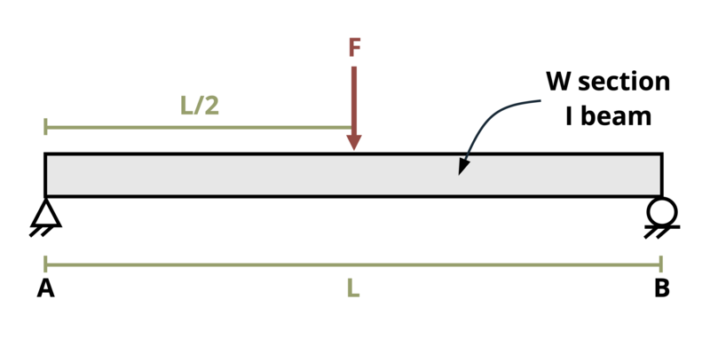

# Problem 9.26 - Beam Design {.unnumbered}

{fig-alt="Picture with an I beam of length L subjected to a point load, F. The point load occurs at a distance of L/2 from the left end of the beam."}

\[Problem adapted from © Kurt Gramoll CC BY NC-SA 4.0\]

```{shinylive-python}
#| standalone: true
#| viewerHeight: 600
#| components: [viewer]

from shiny import App, render, ui, reactive
import random
import asyncio
import io
import math
import string
import pandas as pd
from datetime import datetime
from pathlib import Path

def generate_random_letters(length):
    # Generate a random string of letters of specified length
    return "".join(random.choice(string.ascii_lowercase) for _ in range(length))

problem_ID = "367"
L = reactive.Value("__")
F = reactive.Value("__")
sigma_fail = reactive.Value("__")

attempts = ["Timestamp,Attempt,Answer,Feedback\n"]

attempts = ["Timestamp,Attempt,Answer1,Answer2,Feedback\n"]

app_ui = ui.page_fluid(
    #ui.markdown("**Please enter your ID number from your instructor and click to generate your problem**"),
    #ui.input_text("ID", "", placeholder="Enter ID Number Here"),
    #ui.input_action_button("generate_problem", "Generate Problem", class_="btn-primary"),
    ui.markdown("**Problem Statement**"),
    ui.output_ui("ui_problem_statement"),
    ui.input_text("answer1", "Your Answer for the first beam number", placeholder="Please enter your answer 1"),
    ui.input_text("answer2", "Your Answer for the second beam number", placeholder="Please enter your answer 2"),
    ui.input_action_button("submit", "Submit Answers", class_="btn-primary"),
    #ui.download_button("download", "Download File to Submit", class_="btn-success"),
)

def server(input, output, session):
    # Initialize a counter for attempts
    attempt_counter = reactive.Value(0)

    @output
    @render.ui
    def ui_problem_statement():
        randomize_vars()
        return [ui.markdown(f"A wide flange I-beam of length L = {L()} ft. supports a single load F = {F()} kips at its center. The failure stress is {sigma_fail()} ksi. Determine the lightest W-beam from Appendix A that could be used. Ignore the weight of the beam. ")]

    #@reactive.Effect
    #@reactive.event(input.generate_problem)
    def randomize_vars():
        random.seed(101)
        L.set(random.randrange(10,30,1))
        F.set(random.randrange(10,50,1))
        sigma_fail.set(random.randrange(15,25,1))
        
    @reactive.Effect
    @reactive.event(input.submit)
    def _():
        attempt_counter.set(
            attempt_counter() + 1
        )  # Increment the attempt counter on each submission.
        Ay = F()*L()*12/2/(L()*12)
        M = Ay*L()/2*12
        S = M/sigma_fail()

        # Create a dataframe
        df = pd.DataFrame()

        # Define Beam Name Columns
        df["I-Beam First Num"] = [40,40,40,36,36,36,30,30,30,24,24,24,21,21,21,18,18,18,16,16,16,14,14,14,12,12,12]

        #Define Weight Column
        df["Weight"] = [431,297,264,487,247,210,326,173,99,279,131,84,201,122,68,130,76,40,67,40,31,90,53,34,106,53,26]
        
        # Define S Column
        df["Sx (in^3)"] = [1690,1170,971,1830,913,719,1040,541,269,718,329,196,461,273,140,256,146,68.4,117,64.7,47.2,143,77.8,48.6,145,70.6,33.4]

        # Create Solution Dataframe
        instr=pd.DataFrame()
        instr["First Num"] =[0,0,0,0,0,0,0,0,0,0,0,0,0,0,0,0,0,0,0,0,0,0,0,0,0,0,0]
        instr["Second Num"] = [0,0,0,0,0,0,0,0,0,0,0,0,0,0,0,0,0,0,0,0,0,0,0,0,0,0,0]
        
        # Search for Possible Solutions
        i = 0
        while i < 27:
            if df.iloc[i, 2] >= S:
                instr.iloc[i, 0] = df.iloc[i, 0]
                instr.iloc[i, 1] = df.iloc[i, 1]
            i += 1
        instr = instr.loc[(instr != 0).any(axis=1)]

        #Find Minimum Weight
        wmin = min(instr.iloc[:,1])
        mask = instr['Second Num'] == wmin
        instr = pd.DataFrame(instr[mask])

        correct1 = float(input.answer1()) == instr.iloc[0,0]
        correct2 = float(input.answer2()) == instr.iloc[0,1]
        
        if correct1 and correct2:
            check = "both correct."
        else:
            check = f" {'correct' if correct1 else 'incorrect'} and {'correct' if correct2 else 'incorrect'}."
        
        correct_indicator = "JL" if correct1 and correct2 else "JG"

        random_start = generate_random_letters(4)
        random_middle = generate_random_letters(4)
        random_end = generate_random_letters(4)
        #encoded_attempt = f"{random_start}{problem_ID}-{random_middle}{attempt_counter()}{correct_indicator}-{random_end}{input.ID()}"

        #session.encoded_attempt = reactive.Value(encoded_attempt)
        attempts.append(f"{datetime.now()}, {attempt_counter()}, {input.answer1()}, {input.answer2()}, {check}\n")

        feedback = ui.markdown(f"Your answers of {input.answer1()} and {input.answer2()} are {check}.")
        m = ui.modal(feedback, title="Feedback", easy_close=True)
        ui.modal_show(m)

    #@render.download(filename=lambda: f"Problem_Log-{problem_ID}-{input.ID()}.csv")
    async def download():
        final_encoded = session.encoded_attempt() if session.encoded_attempt is not None else "No attempts"
        yield f"{final_encoded}\n\n"
        yield "Timestamp,Attempt,Answer1,Answer2,Feedback\n"
        for attempt in attempts[1:]:
            await asyncio.sleep(0.25)
            yield attempt

app = App(app_ui, server)
```
