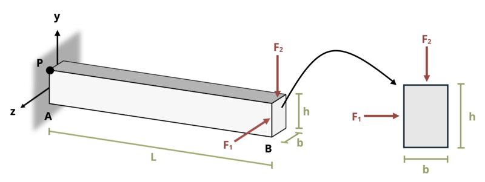

# Problem 9.31 - Unsymmetric Bending {.unnumbered}

## Problem Statement

Two loads, F1 = 8 kips and F2 = 12 kips, are applied at the end of a cantilever beam as shown. Both loads act through the center of the rectangular cross-section of base b = 6 in. and height h = 12 in. If length L = 5 ft, determine the stress at point P in the beam at the wall.

{fig-alt="A cantilever beam of length L has two loads applied at the free end. F1 is applied along the -z axis and F2 is applied along the -y axis. The beam has a base of b and a height of h."}
\[Problem adapted from © Kurt Gramoll CC BY NC-SA 4.0\]
