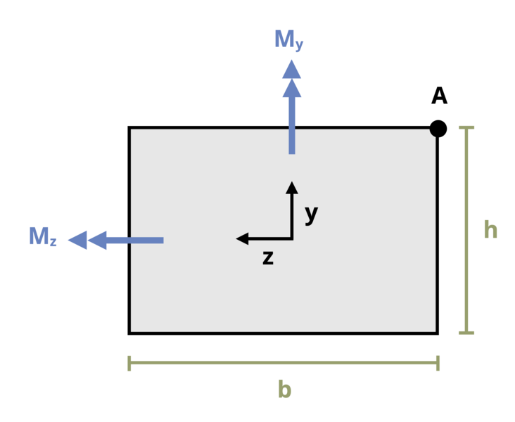

# Problem 9.32 - Unsymmetric Bending {.unnumbered}

## Problem Statement

Two moments, Mz = 1.5 kN-m and My = 1.0 kN-m, act on a beam with the rectangular cross-section shown. If base b = 80 mm and height h = 60 mm, determine the bending stress at point A. Recall the convention that tensile stresses are positive and compressive stresses are negative.

{fig-alt="A beam with a rectangular cross section is subjected to two moments, My and Mz. The beam has a base of b and a height of h."}
\[Problem adapted from © Kurt Gramoll CC BY NC-SA 4.0\]
