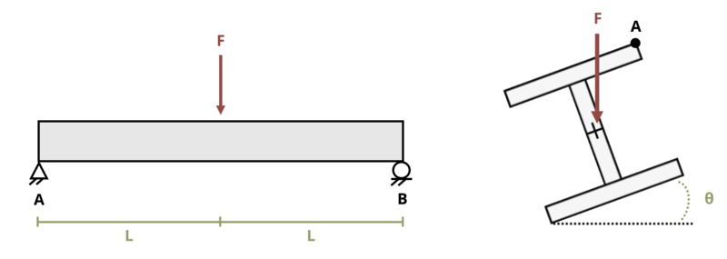

# Problem 9.33 - Unsymmetric Bending {.unnumbered}

## Problem Statement

A W14 x 34 steel beam supports a load F = 5 kips at its center. The beam is on a sloped roof so the load acts at an angle Θ = 22° as shown. If length L = 4 ft, determine the stress at point A. Recall the convention that tensile stresses are positive and compressive stresses are negative.

{fig-alt="A A W14 x 34 steel beam is subjected to a single load. The beam is of length 2L and the load F is applied a distance of L from the left end. The beam has a height of 10 in and a width of 4.944 in. The beam is at an angle of theta."}
\[Problem adapted from © Kurt Gramoll CC BY NC-SA 4.0\]
