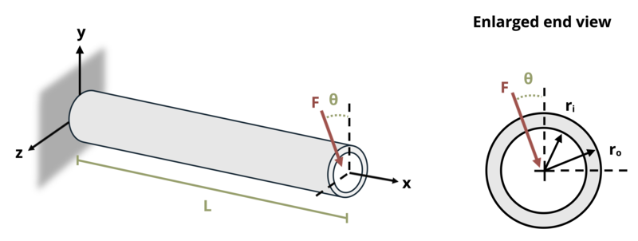

# Problem 9.34 - Unsymmetric Bending {.unnumbered}

## Problem Statement

A cantilevered beam is subjected to a load F = 10 kN at its end, oriented Θ = 25° from the vertical. If length L = 0.35 m, determine the maximum bending stress in the beam. The beam has outer radius ro = 40 mm and inner radius ri = 30 mm.

{fig-alt="A cantilevered beam is subjected to a point load F at its end oriented theta from the vertical. The beam has a ring cross section with an outer radius of ro and an inner radius of ri."}
\[Problem adapted from © Kurt Gramoll CC BY NC-SA 4.0\]
